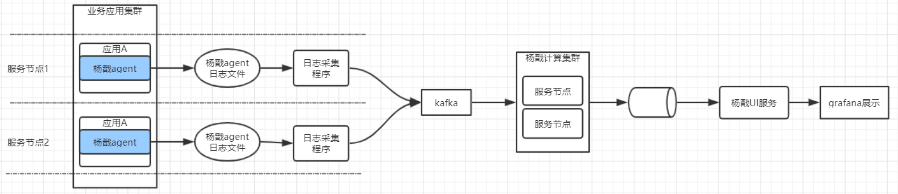
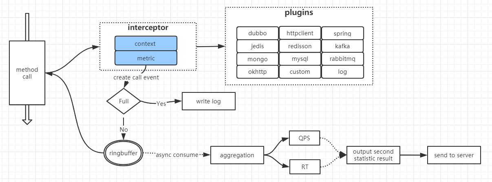
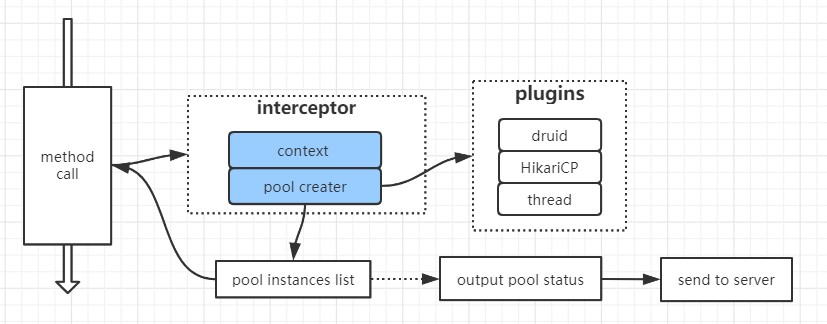
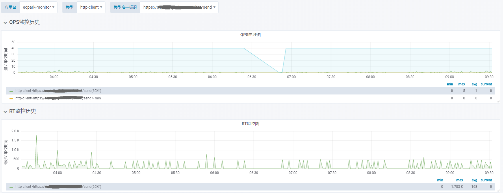
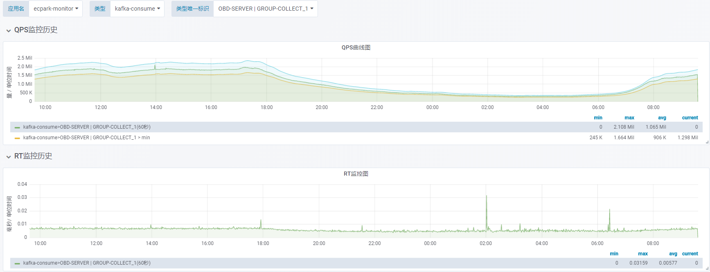
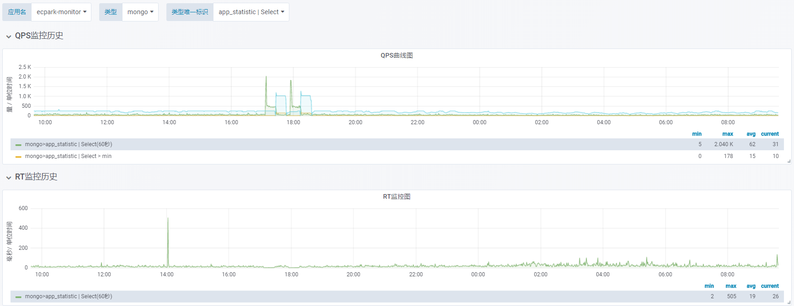
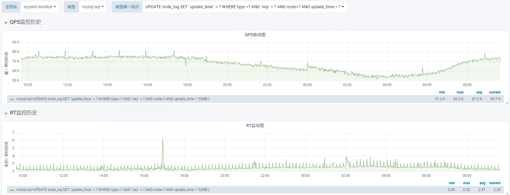
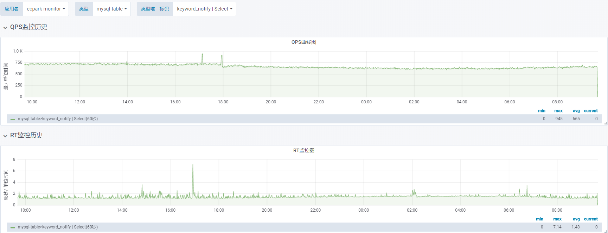
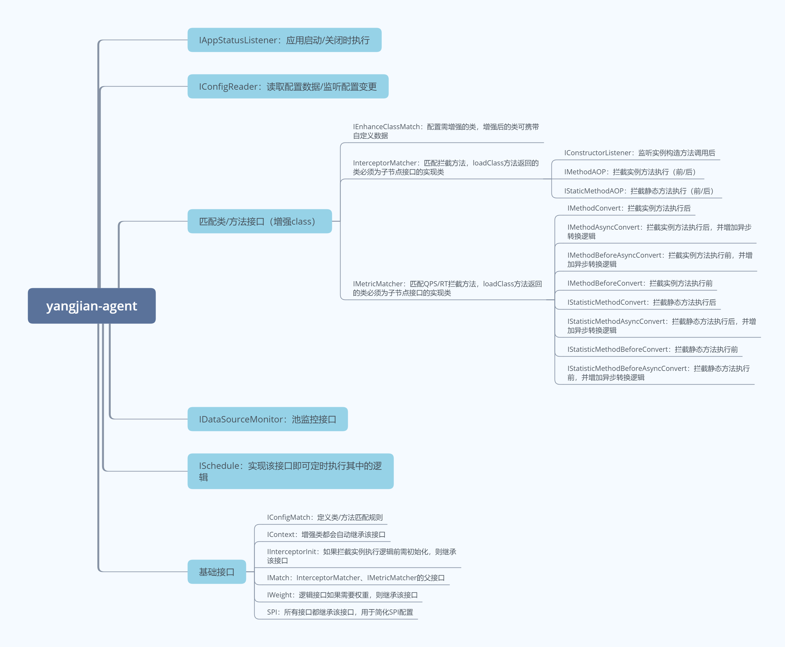
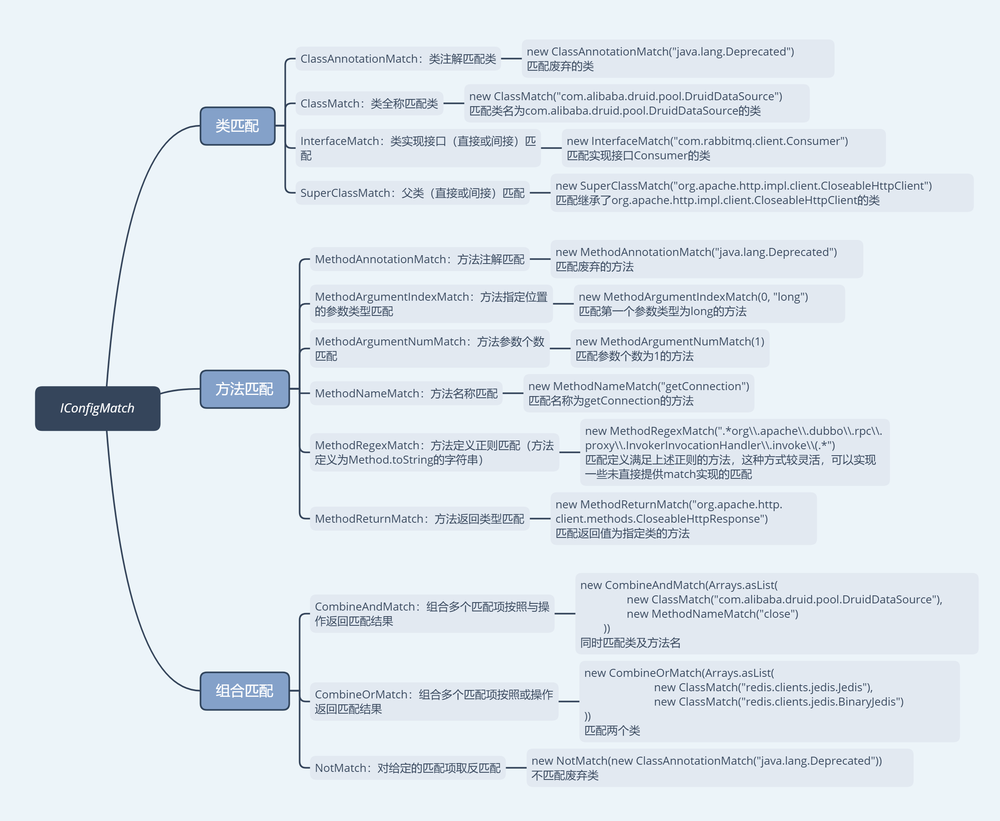

# 杨戬(yangjian)
 [](/LICENSE)

yangjian-agent是一个基于javaagent运行的java性能监控工具，具备较强的扩展性与性能

## 参考

该工具开发时参考的开源项目：
* [skywalking](https://github.com/apache/skywalking)
* [MyPerf4J](https://github.com/LinShunKang/MyPerf4J )
* [druid](https://github.com/alibaba/druid )

## 功能

* 每秒调用量（QPS），已支持spring-controller、dubbo-client、dubbo-server、httpclient、okhttp、kafka、rabbitmq、mongo集合、mysql表及sql自动统计，jedis、redisson、方法配置化统计；

* 每秒平均耗时（RT），已支持spring-controller、dubbo-client、dubbo-server、httpclient、okhttp、kafka、rabbitmq、mongo集合、mysql表及sql自动统计，jedis、redisson、方法配置化统计；
* 池监控：已支持druid、hikaricp，线程池规划中；
* 进程监控：CPU、内存占用量；
* JVM相关数据收集：内存、GC；
* 【规划中】运行时jar包依赖情况；
* 【规划中】运行时资源依赖情况；
* 【规划中】基于日志的异常监控；

## 设计

> 概览图（监控全视角），其中蓝色部分为该工具运行的位置，其他部分为监控系统的整体概览；
>



### QPS/RT

> 其中蓝色部分为可扩展插件；

metric


pool


trace

TODO


## Benchmark

* [性能报告](https://github.com/yametech/yangjian/wiki/%E6%80%A7%E8%83%BD%E6%8A%A5%E5%91%8A )

## 目录结构

```

├─config	//存放监控配置文件以及日志配置文件
│      agent.properties //探针相关配置
│      log.properties	//日志相关配置
│      
├─lib		//探针包
│      yangjian-agent.jar
│      
├─logs		//探针输出的日志目录
└─plugins	//插件包
        agent-plugin-druid-1.0.0-SNAPSHOT.jar
        agent-plugin-dubbo-1.0.0-SNAPSHOT.jar
        agent-plugin-hikaricp-1.0.0-SNAPSHOT.jar
        agent-plugin-httpclient-1.0.0-SNAPSHOT.jar
        agent-plugin-jedis-1.0.0-SNAPSHOT.jar
        agent-plugin-kafka-1.0.0-SNAPSHOT.jar
        agent-plugin-method-1.0.0-SNAPSHOT.jar
        agent-plugin-mongo-1.0.0-SNAPSHOT.jar
        agent-plugin-mysql-1.0.0-SNAPSHOT.jar
        agent-plugin-okhttp-1.0.0-SNAPSHOT.jar
        agent-plugin-rabbitmq-1.0.0-SNAPSHOT.jar
        agent-plugin-redisson-1.0.0-SNAPSHOT.jar
        agent-plugin-spring-1.0.0-SNAPSHOT.jar
	
```

* agent.properties

| key                             | 是否必须 | 说明                                                         | 示例                                                         |
| ------------------------------- | -------- | ------------------------------------------------------------ | ------------------------------------------------------------ |
| service.name                    | 否       | 当前运行的应用名称，因日志生成目录会使用该参数，所以必须有值，该值读取顺序为：读取启动参数中的MonitorAgent.service.name，不存在则读取skywalking.agent.service_name（兼容skywalking，无需重复配置），依然不存在则使用当前配置值，未配置则不增强应用（使用默认值可能导致日志被覆盖），不支持远程配置 | test-service                                                 |
| config.remote_url               | 否       | 如果启用了远程配置，则必须配置该值，用于远程加载配置         | http://test.com/config                                       |
| spi.SPI接口实例类名             | 否       | 用于禁用一个SPI接口实例（不配置默认为启用）                  | spi.JVMMetricsSchedule=disable                               |
| ignore.enhance.classRegular     | 否       | 忽略增强的类正则，使用\r\n分隔多个配置                       | ^cn\\\\\.xxx\\\\.\r\n^cn\\\\.yyy\\\\.                        |
| ignore.enhance.methodRegular    | 否       | 忽略增强的方法正则，使用\r\n分隔多个配置                     | .\*test\\\\(\\\\)$\r\n.\*ignore\\\\(\\\\)\$                  |
| methodCallEvent.bufferSize      | 否       | 方法调用事件的缓存队列长度，必须为2的N次方，需考虑占用内存，太小可能导致事件丢弃 | 32768                                                        |
| schedule.corePoolSize           | 否       | 定时任务调度核心线程数，只要继承ISchedule的类都使用此处的线程调度 | 5                                                            |
| InstanceMethodMatcher.唯一标识  | 否       | 自定义实例方法RT/QPS统计，value为正则匹配                    | InstanceMethodMatcher.test=.\*cn\\\\.ecpark\\\\.tool\\\\.javaagent\\\\.TestService\\\\.add\\\\(.* |
| StatisticMethodMatcher.唯一标识 | 否       | 自定义静态方法RT/QPS统计，value为正则匹配                    | StatisticMethodMatcher.test=.\*java\\\\.time\\\\.Duration\\\\.ofHours\\\\(.* |

* log.properties

| key               | 是否必须 | 说明                                                         | 示例                                                         |
| ----------------- | -------- | ------------------------------------------------------------ | ------------------------------------------------------------ |
| log.output        | 否       | 日志输出类型，目前支持：CONSOLE, FILE，如果为CONSOLE则输出到控制台，FILE则按照下方的配置输出到对应的目录下 | FILE                                                         |
| log.dir           | 否       | 日志目录，未配置时windows环境下使用程序目录，linux使用/data/www/logs/cus-ecpark-agent，实际日志输出的文件前会增加项目目录，避免一台机器部署多个接入探针应用时日志文件冲突 |                                                              |
| log.level         | 否       | 日志级别，支持：DEBUG, INFO, WARN, ERROR, OFF                | INFO                                                         |
| log.max_file_size | 否       | 单个日志文件最大大小，单位bytes                              | 31457280                                                     |
| log.max_file_num  | 否       | 日志数量，超过数量的日志文件，按照最后编辑时间删除           | 100                                                          |
| log.pattern       | 否       | 日志格式                                                     | %timestamp[%level]-[%thread]-[%class.method]: %msg%throwable |


## 接入

### 启动脚本

#### Main启动

> 接入前的启动脚本：

```sh
java -Dfile.encoding=utf-8 -Xms256m -Xmx512m -cp ../conf:../lib/* com.xxx.Application
```

> 接入后，调整为：

```sh
java -Dfile.encoding=utf-8 -Xms256m -Xmx512m -javaagent:/目录/lib/yangjian-agent.jar -DMonitorAgent.service.name=应用名称 -cp ../conf:../lib/* com.xxx.Application
```

#### jar启动

> 接入前的启动脚本：

```sh
java -Dfile.encoding=utf-8 -Xms256m -Xmx512m -jar yourApp.jar
```

> 接入后，调整为：

```sh
java -Dfile.encoding=utf-8 -Xms256m -Xmx512m -javaagent:/目录/lib/yangjian-agent.jar -DMonitorAgent.service.name=应用名称 -jar yourApp.jar
```

#### tomcat项目

> linux系统，在tomcat的启动文件tomcat/bin/catalina.sh第一行加：

```sh
CATALINA_OPTS="$CATALINA_OPTS -javaagent:/目录/lib/yangjian-agent.jar -DMonitorAgent.service.name=应用名称";
export CATALINA_OPTS
```

> windows系统，在tomcat的启动文件tomcat/bin/catalina.bat第一行加：

```sh
set "CATALINA_OPTS=-javaagent:/目录/lib/yangjian-agent.jar -DMonitorAgent.service.name=应用名称"
```

### 统计日志示例

```
2020-02-05 06:24:51.744[INFO]-[schedule-8]-[c.e.t.a.c.u.LogUtil.println(71)]: ecpark-monitor/1580855091/method-event/consume?total_num=116594210&period_seconds=2&period_num=4651
2020-02-05 06:24:51.743[INFO]-[schedule-9]-[c.e.t.a.c.u.LogUtil.println(71)]: ecpark-monitor/1580855091/resources?direct_memory=28347&mapped_cache=0&heap=2831007&non_heap=130363
2020-02-05 06:24:51.744[INFO]-[schedule-7]-[c.e.t.a.c.u.LogUtil.println(71)]: ecpark-monitor/1580855091/method-event/product?total_num=116594210&period_seconds=2&period_num=4651&total_discard_num=0&period_discard_num=0
2020-02-05 06:24:51.744[INFO]-[schedule-7]-[c.e.t.a.c.u.LogUtil.println(71)]: ecpark-monitor/1580855091/statistic/hikaricp/connectionPool?hikaricp_active_count=0&hikaricp_max_total=10
2020-02-05 06:24:51.744[INFO]-[schedule-8]-[c.e.t.a.c.u.LogUtil.println(71)]: ecpark-monitor/1580855088/statistic/hikaricp/RT?sign=192.168.9.254%3A6301%2Fecpark_monitor+%7C+GetConnection&rt_max=1&rt_min=0&num=142&rt_total=2
2020-02-05 06:24:51.744[INFO]-[schedule-8]-[c.e.t.a.c.u.LogUtil.println(71)]: ecpark-monitor/1580855088/statistic/mysql-table/RT?sign=node_log+%7C+Update&rt_max=5&rt_min=1&num=252&rt_total=623
2020-02-05 06:24:51.744[INFO]-[schedule-8]-[c.e.t.a.c.u.LogUtil.println(71)]: ecpark-monitor/1580855090/statistic/kafka-publish/RT?sign=TOPIC-STATISTIC-UNIFIED&rt_max=0&rt_min=0&num=2&rt_total=0
2020-02-05 06:24:51.744[INFO]-[schedule-8]-[c.e.t.a.c.u.LogUtil.println(71)]: ecpark-monitor/1580855088/statistic/mysql-sql/RT?sign=select+id%2Cname+from+app++where+name%3D%3F&rt_max=2&rt_min=0&num=15&rt_total=16
2020-02-11 14:34:23.869[INFO]-[schedule-4]-[c.e.t.a.c.u.LogUtil.println(71)]: ecpark-monitor/1581402862/statistic/method/RT?sign=TestService.add%28int%2Cint%29&rt_max=0&rt_min=0&num=10&rt_total=0
```

### UI效果图

以下截图为统计数据结合Grafana的展示效果











## 打包

在项目根目录下执行：`mvn clean package`，根目录下生成的deploy目录文件，即为部署文件

## 扩展（接口）

创建项目并引入api包（yangjian-agent-api，该包无其他依赖），可支持以下接口自定义扩展（可参考现有插件的实现方式）：



### 快速扩展示例

场景：只监控TestService.execute(String cmd)的QPS/RT，以下为业务代码

> 注意：当前场景仅说明如何扩展插件，实际上该场景目前已有插件支持，仅需要配置拦截的类方法定义即可统计QPS/RT；

```java
package cn.xxx.plugin.test;

public class TestService {
	public void execute() {
		// 业务逻辑
		System.err.println("execute()");
	}
    public void execute(String cmd) {
		// 业务逻辑
    	System.err.println("execute(String cmd)");
	}
    public void execute(Integer index) {
		// 业务逻辑
    	System.err.println("execute(Integer index)");
	}
}
```

1、创建maven项目：agent-plugin-test（名称无要求）

2、pom包依赖及配置修改（JDK8及以上）

```xml
<properties>
    <project.build.sourceEncoding>UTF-8</project.build.sourceEncoding>
    <project.reporting.outputEncoding>UTF-8</project.reporting.outputEncoding>
    <java.version>1.8</java.version>
    <maven.compiler.source>1.8</maven.compiler.source>
    <maven.compiler.target>1.8</maven.compiler.target>
    <maven.compiler.compilerVersion>1.8</maven.compiler.compilerVersion>
</properties>

<dependencies>
    <dependency>
        <groupId>com.github.yametech</groupId>
        <artifactId>yangjian-agent-api</artifactId>
        <version>1.0.0-SNAPSHOT</version>
    </dependency>
</dependencies>
```

3、实现IMetricMatcher接口，设置拦截方法

```java
package cn.xxx.plugin.test;

import java.util.Arrays;

import com.yametech.yangjian.agent.api.IMetricMatcher;
import com.yametech.yangjian.agent.api.base.IConfigMatch;
import com.yametech.yangjian.agent.api.base.MethodType;
import com.yametech.yangjian.agent.api.bean.LoadClassKey;
import com.yametech.yangjian.agent.api.configmatch.CombineAndMatch;
import com.yametech.yangjian.agent.api.configmatch.MethodArgumentIndexMatch;
import com.yametech.yangjian.agent.api.configmatch.MethodArgumentNumMatch;
import com.yametech.yangjian.agent.api.configmatch.MethodRegexMatch;

public class TestMatcher implements IMetricMatcher {

	@Override
	public IConfigMatch match() {
		return new CombineAndMatch(Arrays.asList(
				new MethodRegexMatch(".*cn\\.xxx\\.plugin\\.test\\.TestService\\.execute\\(.*"),// 拦截的类及方法定义
				new MethodArgumentNumMatch(1), // 方法参数个数
				new MethodArgumentIndexMatch(0, "java.lang.String")// 方法参数类型
			));
	}

	@Override
	public String type() {
		return "test-type";// 当前QPS/RT的类型，用于UI展示时分组
	}

	@Override
	public LoadClassKey loadClass(MethodType type) {
		return new LoadClassKey("cn.xxx.plugin.test.TestConvert");// 拦截后执行的逻辑
	}
}
```

4、实现IMethodConvert接口，完成方法调用转TimeEvent

```java
package cn.xxx.plugin.test;

import java.lang.reflect.Method;
import java.util.Arrays;
import java.util.List;
import java.util.Map;

import com.yametech.yangjian.agent.api.bean.TimeEvent;
import com.yametech.yangjian.agent.api.convert.IMethodConvert;

public class TestConvert implements IMethodConvert {

	@Override
	public List<TimeEvent> convert(Object thisObj, long startTime, Object[] allArguments, 
			Method method, Object ret, Throwable t, Map<Class<?>, Object> globalVar) throws Throwable {
		TimeEvent event = get(startTime);
		event.setIdentify("TestService.execute(String)");
		return Arrays.asList(event);
	}
}
```

5、在项目目录/src/main/resources/META-INF/services下增加文件`com.yametech.yangjian.agent.api.base.SPI`，并添加以下内容

```
cn.xxx.plugin.test.TestMatcher
```

6、打包

```
maven clean package
```

7、复制`\target\agent-plugin-test-1.0.0-SNAPSHOT.jar`到探针包目录plugins下

8、增加一个main方法测试拦截，并按照文档中的接入-> 启动脚本 -> Main启动

> 如果在IDE下运行，配置对应IDE的启动参数，eclipse可在Run Configurations ...找到对应的Java Application，在Arguments -> VM arguments下增加：`-javaagent:\探针包目录\lib\yangjian-agent.jar -DMonitorAgent.service.name=agent-main-test`

```java
package cn.xxx.plugin.test;

public class Main {
	public static void main(String[] args) {
		TestService service = new TestService();
		service.execute();
		service.execute(1);
		service.execute("123");
		System.exit(0);
	}
}
```

9、修改log.properties的`log.output`为CONSOLE（可在控制台或者运行窗口直接看到输出日志），启动main，如果出现以下日志则拦截成功（可搜索`statistic/test-type`）

```
2020-02-07 11:08:36.515[INFO]-[schedule-2]-[c.e.t.a.c.u.LogUtil.println(71)]: agent-main-test/1581044915/statistic/test-type/RT?sign=TestService.execute%28String%29&rt_max=1&rt_min=1&num=1&rt_total=1
```

> 日志说明：[*应用名称*]/[*方法执行时的秒数*]/statistic/[*TestMatcher中配置的type*]/[RT/QPS]?sign=[*setIdentify配置的*]&rt_max=[*当前秒最大耗时毫秒数*]&rt_min=[*当前秒最小耗时毫秒数*]&num=[*当前秒总执行次数*]&rt_total=[*总耗时毫秒数*]

### IConfigMatch实现使用说明



## License

[Apache License 2.0](/LICENSE)
